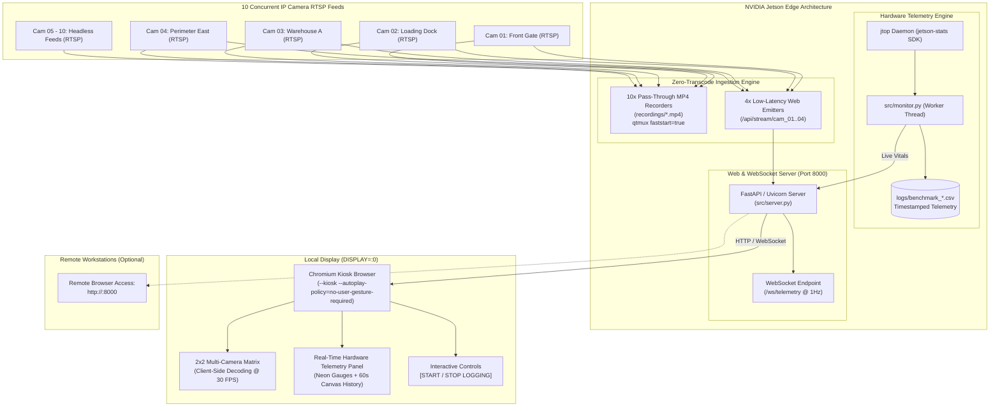

# NVIDIA Jetson Multi-Stream CCTV Benchmark: System Architecture & Operations Manual

**Version:** 1.2.0  
**Target Platform:** NVIDIA Jetson (JetPack 5.x / 6.x — Orin AGX, Orin NX, Orin Nano, Xavier, TX2, Nano)  
**Author:** Edge AI & Surveillance Engineering Team  

---

## Table of Contents

1. [Executive Summary](#1-executive-summary)
2. [Workload Architecture](#2-workload-architecture)
   - [2.1 Zero-Transcode Pass-Through Remuxing](#21-zero-transcode-pass-through-remuxing)
   - [2.2 4-Stream Web Frontend & Client-Side Decoding](#22-4-stream-web-frontend--client-side-decoding)
   - [2.3 Hardware Telemetry Engine (`jtop`)](#23-hardware-telemetry-engine-jtop)
3. [System Architecture Diagram](#3-system-architecture-diagram)
4. [Telemetry Metric Dictionary](#4-telemetry-metric-dictionary)
5. [Prerequisites & Jetson Environment Setup](#5-prerequisites--jetson-environment-setup)
6. [Configuration Guide (`config/cameras.json`)](#6-configuration-guide-configcamerasjson)
7. [Operating Modes & Execution Workflows](#7-operating-modes--execution-workflows)
   - [Mode A: Full Kiosk Benchmark (Local HDMI Display)](#mode-a-full-kiosk-benchmark-local-hdmi-display)
   - [Mode B: Headless Remote Benchmark (Over SSH / LAN Access)](#mode-b-headless-remote-benchmark-over-ssh--lan-access)
   - [Mode C: Offline Mock Testing (RTSP Simulator)](#mode-c-offline-mock-testing-rtsp-simulator)
   - [Mode D: Pipeline Dry-Run Validation](#mode-d-pipeline-dry-run-validation)
8. [Interactive Logging & Reporting](#8-interactive-logging--reporting)
   - [8.1 Start & Stop Controls](#81-start--stop-controls)
   - [8.2 Windows/Excel File Lock Resilience](#82-windowsexcel-file-lock-resilience)
   - [8.3 Executive Benchmark Summary Table](#83-executive-benchmark-summary-table)
9. [Troubleshooting & Performance Tuning](#9-troubleshooting--performance-tuning)

---

## 1. Executive Summary

Edge video surveillance systems require high-density multi-camera video ingestion coupled with real-time video display and monitoring. However, edge platforms such as NVIDIA Jetson modules have hard silicon limits on:
- **CPU bandwidth:** Multi-threaded packet demuxing and operating system overhead.
- **NVDEC (NVIDIA Video Decoder Engine):** Maximum concurrent frames-per-second (FPS) and resolution limits.
- **Unified Memory (RAM/VRAM):** Memory bus bandwidth and capacity constraints.
- **Thermal Dissipation:** Power envelope (`MAXN` vs `15W` / `25W` modes) and thermal throttling under sustained loads.
- **Client-Side Decoding Overhead:** Running a full web browser (Chromium) on the edge device to render video grids and animated UI dashboards introduces significant V8 JavaScript execution and GPU/Blink compositing overhead.

### Objective
This benchmarking suite provides a reproducible, end-to-end stress test to evaluate the maximum capacity and stability of an NVIDIA Jetson module running:
1. **10 concurrent IP camera RTSP streams** saved directly to disk (`.mp4`).
2. **4 concurrent video streams** displayed in a real-time 2x2 grid within a web frontend.
3. **Chromium kiosk browser** running on the Jetson's local display (`DISPLAY=:0`) to capture real-world client-side decoding load.
4. **Continuous telemetry logging** capturing CPU, GPU, NVDEC, NVENC, RAM, Power (mW), and Temperature (°C) to a timestamped CSV file via `jtop`.

---

## 2. Workload Architecture

### 2.1 Zero-Transcode Pass-Through Remuxing
Traditional surveillance NVR software frequently makes the mistake of fully decoding video frames to raw pixel buffers (`RGB`/`I420`) before re-encoding them to disk. This quickly exhausts the NVDEC hardware decoders and NVENC encoders.

**Our Architecture:**
- **For all 10 cameras:** The raw H.264/H.265 NAL units received over RTSP/RTP are depayloaded and packetized directly into MP4 containers using `qtmux faststart=true`.
- **Zero Transcoding:** No decoding or encoding occurs for the recording pipeline. The recording consumes near-zero CPU and zero NVDEC/NVENC capacity, preserving the hardware for display and AI inference.

```text
RTSP Camera -> rtspsrc -> rtph264depay -> h264parse -> queue -> qtmux (faststart) -> filesink (.mp4)
```

### 2.2 4-Stream Web Frontend & Client-Side Decoding
Four of the 10 streams are selected for live operator viewing in a 2x2 grid. 
- In production, surveillance operators view feeds in a web browser.
- Running Chromium on the Jetson evaluates the combined load of:
  - Video stream decoding (Blink / HTML5 `<video>` / multipart JPEG streams).
  - V8 JavaScript runtime (WebSocket telemetry listeners, Canvas line graphs).
  - Hardware accelerated GPU compositing.
- The web server ([src/server.py](file:///d:/UpTime%20Pro/jetson-multistream-benchmark/src/server.py)) is built on **FastAPI** and **Uvicorn**, serving the dashboard at `http://0.0.0.0:8000`.

### 2.3 Hardware Telemetry Engine (`jtop`)
The telemetry worker ([src/monitor.py](file:///d:/UpTime%20Pro/jetson-multistream-benchmark/src/monitor.py)) connects to the `jtop` (jetson-stats) Python SDK:
- Samples hardware statistics every 1.0 second (configurable).
- Broadcasts real-time JSON samples to the web frontend over WebSockets (`/ws/telemetry`).
- Writes time-stamped telemetry rows to a CSV file in `logs/benchmark_<timestamp>.csv`.
- Features an **Automatic Fallback Mode**: When run on a non-Jetson machine (e.g. Windows PC during development), it automatically falls back to `psutil` system metrics so the entire application can be previewed and verified offline.

---

## 3. System Architecture Diagram



---

## 4. Telemetry Metric Dictionary

Every benchmark run logs the following 14 columns to the CSV output at every sample interval:

| Column Header | Unit | Typical Range on Jetson | Description & Manager Review Meaning |
|---|---|---|---|
| `timestamp` | ISO 8601 | String | Exact date and time with millisecond precision (e.g. `2026-09-15T15:48:44.120`). |
| `cpu_avg_pct` | `%` | `15.0% – 85.0%` | **Average CPU Utilization:** Overall percentage across all online CPU cores. Consistent values above 85% indicate packet demuxing or background process saturation. |
| `cpu_cores_pct` | `%` list | Semicolon list | **Per-Core CPU Load:** Individual core loads (e.g. `20.1;18.4;45.0;12.3`). Useful for spotting single-threaded bottlenecks. |
| `gpu_gr3d_pct` | `%` | `5.0% – 45.0%` | **GPU 3D Engine Load:** Tegra GPU engine utilization (Blink browser compositing, WebGL, CUDA). |
| `nvdec_pct` | `%` | `30.0% – 80.0%` | **NVDEC Hardware Video Decoder Utilization:** Load on the dedicated silicon video decoding chip. Directly indicates how hard the hardware decoder is working to process the 4 display streams. |
| `nvenc_pct` | `%` | `0.0%` | **NVENC Hardware Video Encoder Utilization:** Expected to remain ~0% because all 10 recordings use zero-transcode remuxing rather than re-encoding. |
| `ram_used_mb` | `MB` | `3000 – 7000 MB` | Physical unified system memory currently consumed by the OS, Chromium browser, GStreamer, and the web server. |
| `ram_total_mb` | `MB` | Module specific | Total physical unified memory available on the module (e.g. ~7700 MB on an 8GB Orin, ~15600 MB on a 16GB Orin). |
| `ram_pct` | `%` | `20.0% – 75.0%` | Percentage of total unified memory in use. Values >85% signal memory pressure and imminent swap thrashing. |
| `swap_used_mb` | `MB` | `0 – 500 MB` | Virtual memory/swap space used. A rising swap value signals insufficient physical RAM for the active stream count. |
| `power_mw` | `mW` | `8000 – 25000 mW` | **Total Board Power Consumption:** Instantaneous electrical power in milliwatts (e.g., `14500 mW` = `14.5 W`) measured by on-board INA monitor ICs. |
| `temp_cpu_c` | `°C` | `40.0°C – 70.0°C` | Core temperature of the CPU cluster. Sustained temperatures >85°C will trigger Tegra thermal throttling. |
| `temp_gpu_c` | `°C` | `40.0°C – 68.0°C` | Core temperature of the Tegra GPU. |
| `temp_aux_c` | `°C` | `35.0°C – 60.0°C` | Board ambient thermal zone temperature. |

---

## 5. Prerequisites & Jetson Environment Setup

### 5.1 System Packages (JetPack Linux / Ubuntu 20.04 or 22.04)
Run the following commands on the Jetson terminal to install GStreamer plugins, Python bindings, and Chromium:

```bash
# Update repositories
sudo apt-get update

# Install GStreamer plugins, Python GObject bindings, and Chromium
sudo apt-get install -y \
    python3-pip \
    python3-gi \
    python3-gst-1.0 \
    gstreamer1.0-tools \
    gstreamer1.0-plugins-base \
    gstreamer1.0-plugins-good \
    gstreamer1.0-plugins-bad \
    gstreamer1.0-plugins-ugly \
    chromium-browser \
    ffmpeg \
    curl
```

### 5.2 Python Dependencies
Install the required benchmark packages:

```bash
pip3 install -r requirements.txt
```

Verify that the `jtop` service daemon is running:
```bash
sudo systemctl restart jtop
jtop --version
```

### 5.3 Jetson Clock Performance Configuration (Recommended)
To prevent the Jetson governor from aggressively downclocking during benchmarks:
```bash
# Set module to maximum performance power mode (e.g., MAXN mode)
sudo nvpmodel -m 0

# Lock CPU/GPU/EMC clocks to maximum rated frequencies
sudo jetson_clocks
```

---

## 6. Configuration Guide (`config/cameras.json`)

The camera stream topology is configured in [config/cameras.json](file:///d:/UpTime%20Pro/jetson-multistream-benchmark/config/cameras.json):

```json
{
  "grid": {
    "output_width": 1920,
    "output_height": 1080,
    "fps": 30
  },
  "display_cameras": [
    {
      "id": "cam_01",
      "name": "Front Gate",
      "url": "rtsp://192.168.1.101:554/stream1",
      "codec": "h264",
      "latency_ms": 200,
      "xpos": 0,
      "ypos": 0,
      "width": 960,
      "height": 540
    },
    {
      "id": "cam_02",
      "name": "Loading Dock",
      "url": "rtsp://192.168.1.102:554/stream1",
      "codec": "h264",
      "latency_ms": 200,
      "xpos": 960,
      "ypos": 0,
      "width": 960,
      "height": 540
    },
    {
      "id": "cam_03",
      "name": "Warehouse A",
      "url": "rtsp://192.168.1.103:554/stream1",
      "codec": "h264",
      "latency_ms": 200,
      "xpos": 0,
      "ypos": 540,
      "width": 960,
      "height": 540
    },
    {
      "id": "cam_04",
      "name": "Perimeter East",
      "url": "rtsp://192.168.1.104:554/stream1",
      "codec": "h264",
      "latency_ms": 200,
      "xpos": 960,
      "ypos": 540,
      "width": 960,
      "height": 540
    }
  ],
  "record_only_cameras": [
    {
      "id": "cam_05",
      "name": "Server Room",
      "url": "rtsp://192.168.1.105:554/stream1",
      "codec": "h264",
      "latency_ms": 200
    },
    {
      "id": "cam_06",
      "name": "Hallway North",
      "url": "rtsp://192.168.1.106:554/stream1",
      "codec": "h264",
      "latency_ms": 200
    },
    {
      "id": "cam_07",
      "name": "Parking Lot West",
      "url": "rtsp://192.168.1.107:554/stream1",
      "codec": "h264",
      "latency_ms": 200
    },
    {
      "id": "cam_08",
      "name": "Reception",
      "url": "rtsp://192.168.1.108:554/stream1",
      "codec": "h264",
      "latency_ms": 200
    },
    {
      "id": "cam_09",
      "name": "Emergency Exit",
      "url": "rtsp://192.168.1.109:554/stream1",
      "codec": "h264",
      "latency_ms": 200
    },
    {
      "id": "cam_10",
      "name": "Roof Access",
      "url": "rtsp://192.168.1.110:554/stream1",
      "codec": "h264",
      "latency_ms": 200
    }
  ]
}
```

### Parameter Reference
- **`display_cameras` (4 entries):** Ingested, recorded, and decoded for the 2x2 grid.
- **`record_only_cameras` (6 entries):** Ingested and recorded directly to disk via pass-through remuxing (zero decoding overhead).
- **`codec`:** Set to `"h264"` or `"h265"`.
- **`latency_ms`:** GStreamer `rtspsrc` network buffer latency in milliseconds (default `200`). Increase to `500` if cameras operate over Wi-Fi.

---

## 7. Operating Modes & Execution Workflows

### Mode A: Full Kiosk Benchmark (Local HDMI Display)
**Recommended for evaluating true client-side decoding overhead on the Jetson.**  
Runs 10 recordings, serves the web dashboard, and automatically opens Chromium in fullscreen kiosk mode on `DISPLAY=:0`:

```bash
python3 benchmark_pipeline.py --duration 120 --kiosk
```
- Benchmark runs for 120 seconds.
- Spawns fullscreen Chromium kiosk on the connected monitor.
- Finalizes MP4 headers and outputs summary statistics to the terminal.

---

### Mode B: Headless Remote Benchmark (Over SSH / LAN Access)
If the Jetson is installed in a server rack without a physical monitor connected:

```bash
python3 benchmark_pipeline.py --headless --duration 300
```
- Runs in headless mode (no X11 window required).
- Managers and engineers can view the live surveillance dashboard and real-time telemetry from any laptop browser on the local network by navigating to:
  ```text
  http://<JETSON_IP_ADDRESS>:8000
  ```

---

### Mode C: Offline Mock Testing (RTSP Simulator)
If you do not have 10 physical IP cameras connected to your network, launch the built-in multi-stream simulator:

```bash
# Terminal 1: Start 10 local RTSP feeds using MediaMTX and FFmpeg
chmod +x simulate_streams.sh
./simulate_streams.sh

# Terminal 2: Run the benchmark against the local mock feeds
python3 benchmark_pipeline.py --duration 60 --kiosk
```

---

### Mode D: Pipeline Dry-Run Validation
Verify pipeline launch string syntax and JSON camera configuration without starting GStreamer or opening video devices:

```bash
python3 benchmark_pipeline.py --dry-run
```

---

## 8. Interactive Logging & Reporting

### 8.1 Start & Stop Controls
The benchmark provides interactive logging controls via both the Web Dashboard and the REST API:
- **Dashboard Button:** Located in the top right header (`[STOP LOGGING]` / `[START LOGGING]`).
- **REST Endpoints:**
  - `POST /api/logging/start` — Resumes or starts a new telemetry recording session.
  - `POST /api/logging/stop` — Pauses logging and cleanly closes file handles.
  - `GET /api/logging/status` — Returns the current state (`is_logging`, `logged_samples`, `csv_path`).

> [!TIP]
> When logging is stopped, the live dashboard gauges, video feeds, and 60-second Canvas history graph **remain active and functional**. Only writing to the CSV file is paused.

### 8.2 Windows/Excel File Lock Resilience
On Windows systems, opening a CSV file in Microsoft Excel places an exclusive OS write lock on the file (`Errno 13: Permission denied`).  
- The `HardwareMonitor` handles this gracefully: If a file lock is detected, telemetry rows are **temporarily buffered in RAM** instead of crashing.
- Once you close the file in Excel or click `[STOP LOGGING]`, the buffered rows automatically flush to disk without data loss.

### 8.3 Executive Benchmark Summary Table
Upon benchmark completion (or when pressing `Ctrl+C`), an aggregated statistics summary table is printed to the terminal:

```text
================================================================================
                  JETSON MULTI-STREAM BENCHMARK SUMMARY
================================================================================
Samples Collected : 60
Elapsed Duration  : 60.0 s
Hardware Mode     : NVIDIA JetPack (jtop)
CSV Metrics File  : logs/benchmark_20260915_154844.csv
Recordings Folder : recordings
--------------------------------------------------------------------------------
╒═════════════════════════════════╤═══════════╤═══════════╤═══════════╕
│ Metric                          │ Average   │ Maximum   │ Minimum   │
╞═════════════════════════════════╪═══════════╪═══════════╪═══════════╡
│ CPU Average (%)                 │ 28.4      │ 42.1      │ 19.8      │
│ GPU GR3D (%)                    │ 14.2      │ 24.0      │ 8.5       │
│ NVDEC Hardware Decoder (%)      │ 52.6      │ 68.0      │ 45.0      │
│ NVENC Hardware Encoder (%)      │ 0.0       │ 0.0       │ 0.0       │
│ RAM Used (MB)                   │ 4210.5    │ 4450.0    │ 3980.2    │
│ RAM Utilization (%)             │ 26.8      │ 28.3      │ 25.3      │
│ System Power Draw (mW)          │ 14250.0   │ 18600.0   │ 11200.0   │
│ CPU Temperature (°C)            │ 48.5      │ 54.0      │ 44.0      │
│ GPU Temperature (°C)            │ 46.2      │ 51.5      │ 42.0      │
╘═════════════════════════════════╧═══════════╧═══════════╧═══════════╛
================================================================================
```

---

## 9. Troubleshooting & Performance Tuning

| Symptom / Error | Root Cause | Resolution |
|---|---|---|
| `Cannot open display :0` | Running over SSH without an X11 display context. | Run with `--headless` flag, or export `export DISPLAY=:0` if a monitor is physically attached. |
| `No element "nvv4l2decoder"` | NVIDIA Tegra multimedia GStreamer packages missing. | Run `sudo apt-get install -y nvidia-l4t-gstreamer`. Test with `gst-inspect-1.0 nvv4l2decoder`. |
| Corrupted / Unplayable `.mp4` recordings | Abrupt process termination (`kill -9`) prevented the MP4 `moov` atom header from being finalized. | Always exit using `Ctrl+C` or `--duration`. The runner automatically catches `SIGINT`/`SIGTERM` and sends `GST_EVENT_EOS` to cleanly flush file headers. |
| Frame drops / High latency on RTSP | Camera UDP packets dropping over congested network. | In `config/cameras.json`, increase `latency_ms` from `200` to `500` or enforce TCP transport (`protocols=tcp`). |
| System power throttling / Thermal alerts | Module operating in high ambient temperature or under undersized power supply. | Set power mode with `sudo nvpmodel -m 0` (or `15W` mode if using an edge DC supply), ensure cooling fan is running (`sudo jetson_clocks`), and inspect `power_mw` in the benchmark CSV. |
