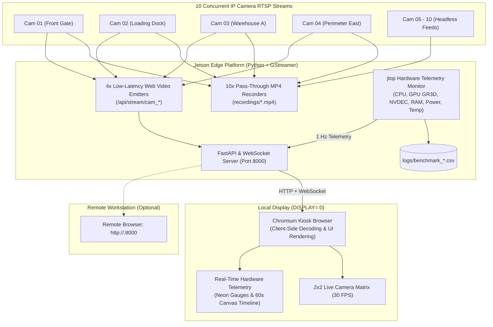

# NVIDIA Jetson Multi-Stream CCTV Benchmark with Live Frontend Dashboard

[-green.svg)](https://developer.nvidia.com/embedded/jetson-linux)
[](https://gstreamer.freedesktop.org/)
[-blue.svg)](https://github.com/rbonghi/jetson_stats)
[](https://fastapi.tiangolo.com/)

A production-ready edge benchmarking suite designed to measure system resource utilization, hardware accelerator load, and thermal stability of **NVIDIA Jetson** systems (Orin, Xavier, Nano) under a full-stack real-world edge surveillance workload.

---

## Benchmark Workload Summary

1. **Ingest & Record (All 10 Streams):**
   - Zero-transcode direct-to-disk MP4 remuxing (`.mp4`) with `faststart` enabled.
   - For the **6 record-only streams**: bypasses video decoding completely (`rtph264depay` $\rightarrow$ `h264parse` $\rightarrow$ `qtmux` $\rightarrow$ `filesink`), conserving NVDEC and CPU cycles.
2. **Live Web Streaming & 2x2 Display Grid (4 Streams):**
   - 4 camera feeds are streamed to a high-performance, dark-mode web frontend.
   - Renders a real-time **2x2 video grid** at 30 FPS.
3. **Chromium Kiosk on Local Display (`DISPLAY=:0`):**
   - Launches fullscreen Chromium in kiosk mode directly on the Jetson monitor.
   - **Evaluates real-world client-side decoding and UI rendering overhead** (Blink rendering engine, V8 JavaScript, and client-side hardware/software video decoding).
4. **Hardware Telemetry Engine (`jtop`):**
   - Background thread collecting granular system vitals at 1.0s intervals.
   - Streams live 1 Hz telemetry over WebSockets to the frontend dashboard (live circular gauges and scrolling Canvas timeline charts).
   - Concurrently logs time-stamped telemetry to a structured CSV file (`logs/benchmark_<timestamp>.csv`) for manager review.

---

## Architecture Diagram



---

## Directory Structure

```text
jetson-multistream-benchmark/
├── config/
│   └── cameras.json          # 10 RTSP camera URLs and grid tile settings
├── logs/                     # Generated CSV metrics and logs
├── recordings/               # Output directory for stream recordings (.mp4)
├── src/
│   ├── __init__.py
│   ├── pipeline.py           # Modular GStreamer pipeline builder
│   ├── monitor.py            # jtop background thread logging stats to CSV
│   └── server.py             # FastAPI web server, streaming endpoints, & WebSockets
├── web/
│   ├── index.html            # Mission-control surveillance dashboard
│   ├── style.css             # Glassmorphic dark-slate styling and neon gauges
│   └── app.js                # WebSocket telemetry client & real-time Canvas charts
├── benchmark_pipeline.py     # Main CLI entrypoint to start capture, display, and logging
├── launch_kiosk.sh           # Chromium fullscreen kiosk mode launcher for DISPLAY=:0
├── simulate_streams.sh       # MediaMTX / FFmpeg loop script for local RTSP mock testing
├── requirements.txt          # Python dependencies
└── README.md                 # Documentation and benchmark instructions
```

---

## Prerequisites & Installation

### 1. Jetson System Dependencies
Ensure you are running NVIDIA JetPack with Tegra multimedia packages and Chromium installed:

```bash
# Update package repositories
sudo apt-get update

# Install GStreamer core, plugins, Python bindings, and Chromium
sudo apt-get install -y \
    python3-pip \
    python3-gi \
    python3-gst-1.0 \
    gstreamer1.0-tools \
    gstreamer1.0-plugins-base \
    gstreamer1.0-plugins-good \
    gstreamer1.0-plugins-bad \
    gstreamer1.0-plugins-ugly \
    chromium-browser \
    ffmpeg \
    curl
```

### 2. Python Dependencies
Install required Python packages:

```bash
pip3 install -r requirements.txt
```

Verify that the `jtop` daemon is active:
```bash
sudo systemctl restart jtop
jtop --version
```

---

## Quickstart & Usage

### 1. Local RTSP Stream Simulation (Optional Mock Testing)
If developing without access to 10 physical IP cameras, run the included simulator:

```bash
chmod +x simulate_streams.sh
./simulate_streams.sh
```
This script downloads `mediamtx` (if not present) and publishes 10 local 1080p @ 30fps H.264 test feeds at `rtsp://localhost:8554/cam0` through `cam9`.

### 2. Validating Pipelines (Dry Run)
Inspect generated pipeline syntax, verify camera JSON configuration, and check device paths without starting streams:

```bash
python3 benchmark_pipeline.py --dry-run
```

### 3. Run Benchmark with Fullscreen Kiosk Dashboard (Recommended)
Run a 60-second benchmark. This starts:
- 10 pass-through MP4 file recordings.
- Web server with WebSocket telemetry.
- Fullscreen Chromium kiosk on `DISPLAY=:0` rendering the 2x2 camera grid and live telemetry:

```bash
python3 benchmark_pipeline.py --duration 60 --kiosk
```

### 4. Run Benchmark Headless (Over SSH / Remote Review)
If testing remotely over SSH without a physical monitor connected to the Jetson:

```bash
python3 benchmark_pipeline.py --headless --duration 120
```
*(Managers can view the live dashboard remotely by navigating to `http://<jetson-ip>:8000` in any browser on the local network).*

### 5. CLI Options Reference

| Argument | Type | Default | Description |
|---|---|---|---|
| `--config` | string | `config/cameras.json` | Path to camera configuration file |
| `--duration` | int | `None` | Benchmark run duration in seconds (runs until Ctrl+C if omitted) |
| `--interval` | float | `1.0` | Telemetry polling interval in seconds |
| `--kiosk` | flag | `False` | Launch fullscreen Chromium browser kiosk on `DISPLAY=:0` |
| `--open-browser` | flag | `False` | Open dashboard in windowed browser |
| `--no-frontend` | flag | `False` | Disable web dashboard (CLI-only mode) |
| `--host` | string | `0.0.0.0` | Web server host address |
| `--port` | int | `8000` | Web server port |
| `--headless` | flag | `False` | Run without opening local X11 video window |
| `--software-decode` | flag | `False` | Force software decoders (`avdec_h264`, `compositor`) |
| `--console-metrics` | flag | `False` | Stream live telemetry samples to stdout during run |
| `--dry-run` | flag | `False` | Validate configs and print pipeline strings |
| `--log-dir` | string | `logs` | Directory for CSV telemetry output |
| `--recordings-dir` | string | `recordings` | Directory for MP4 recordings |

---

## Live Frontend Dashboard Features

The dashboard served at `http://localhost:8000` provides:
- **2x2 Multi-Camera Matrix:** Live video feeds from the 4 primary cameras with burnt-in timestamps, latency indicators, and recording badges.
- **10-Stream Ingestion Status Strip:** Real-time recording health indicators for all 10 cameras.
- **Real-Time Hardware Telemetry Panel:**
  - Glowing circular SVG gauges for **CPU Load %**, **GPU (GR3D) %**, **NVDEC Engine %**, and **System RAM %**.
  - **Live 60-second Scrolling Timeline Chart:** High-performance HTML5 Canvas rendering of resource trends over time.
  - Thermal & electrical vitals: System Power Draw (`mW` / `W`), CPU Temp (`°C`), GPU Temp (`°C`), and NVENC usage.
  - Active CSV log path and recorded sample count.

---

## Telemetry & Metrics Output

### CSV Metrics File Format
Every benchmark run writes a timestamped CSV in `logs/benchmark_<timestamp>.csv`:

| Column | Unit | Description |
|---|---|---|
| `timestamp` | ISO 8601 | Sample timestamp (e.g. `2026-09-15T12:00:01.250`) |
| `cpu_avg_pct` | % | Average CPU load across all online cores |
| `cpu_cores_pct` | % list | Semicolon-separated per-core CPU load |
| `gpu_gr3d_pct` | % | NVIDIA Tegra GPU Graphics / 3D Compute engine load |
| `nvdec_pct` | % | NVIDIA hardware video decoder engine utilization |
| `nvenc_pct` | % | NVIDIA hardware video encoder engine utilization |
| `ram_used_mb` | MB | System RAM currently in use |
| `ram_total_mb` | MB | Total physical system RAM |
| `ram_pct` | % | System RAM utilization percentage |
| `swap_used_mb` | MB | Swap memory in use |
| `power_mw` | mW | Total module electrical power consumption in milliwatts |
| `temp_cpu_c` | °C | CPU thermal zone temperature |
| `temp_gpu_c` | °C | GPU thermal zone temperature |
| `temp_aux_c` | °C | Board auxiliary thermal zone temperature |

### Benchmark Summary Report (Manager Review)
At the conclusion of each benchmark run, the CLI outputs an aggregated statistics summary table:

```text
================================================================================
                  JETSON MULTI-STREAM BENCHMARK SUMMARY
================================================================================
Samples Collected : 60
Elapsed Duration  : 60.0 s
Hardware Mode     : NVIDIA JetPack (jtop)
CSV Metrics File  : logs/benchmark_20260915_120000.csv
Recordings Folder : recordings
--------------------------------------------------------------------------------
╒═════════════════════════════════╤═══════════╤═══════════╤═══════════╕
│ Metric                          │ Average   │ Maximum   │ Minimum   │
╞═════════════════════════════════╪═══════════╪═══════════╪═══════════╡
│ CPU Average (%)                 │ 28.4      │ 42.1      │ 19.8      │
│ GPU GR3D (%)                    │ 14.2      │ 24.0      │ 8.5       │
│ NVDEC Hardware Decoder (%)      │ 52.6      │ 68.0      │ 45.0      │
│ NVENC Hardware Encoder (%)      │ 0.0       │ 0.0       │ 0.0       │
│ RAM Used (MB)                   │ 4210.5    │ 4450.0    │ 3980.2    │
│ RAM Utilization (%)             │ 26.8      │ 28.3      │ 25.3      │
│ System Power Draw (mW)          │ 14250.0   │ 18600.0   │ 11200.0   │
│ CPU Temperature (°C)            │ 48.5      │ 54.0      │ 44.0      │
│ GPU Temperature (°C)            │ 46.2      │ 51.5      │ 42.0      │
╘═════════════════════════════════╧═══════════╧═══════════╧═══════════╛
================================================================================
```

---

## Troubleshooting

1. **`Chromium not opening on DISPLAY=:0`:**
   - If running via SSH, specify `export DISPLAY=:0` before running or use the `--kiosk` flag which sets this automatically.
2. **Accessing dashboard from another computer:**
   - The web server listens on `0.0.0.0:8000`. On a remote laptop connected to the same LAN or VPN, navigate to `http://<jetson-ip>:8000`.
3. **Missing GStreamer plugins:**
   - Verify hardware plugins: `gst-inspect-1.0 nvv4l2decoder` and `gst-inspect-1.0 nvcompositor`.
   - If missing, ensure `nvidia-l4t-gstreamer` is installed.
4. **Corrupted MP4 files on early exit:**
   - The runner traps `SIGINT` (Ctrl+C) and sends `GST_EVENT_EOS` down the pipeline to properly commit the MP4 `moov` atom header. Always allow a second for the clean shutdown to finish.
